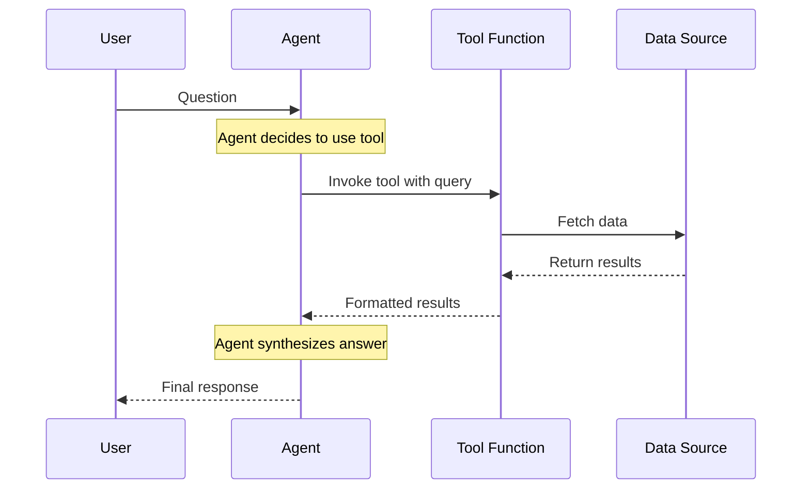

# Agent-Tool Architecture - Generic Pattern

**Phase:** 24 (Documentation & Final Verification)
**Purpose:** Illustrate reusable agent-tool interaction pattern

## Sequence Diagram

## Pattern Description

This diagram illustrates the generic agent-tool interaction pattern used throughout the Day 4 implementations. The pattern is framework-agnostic and applies to any combination of agent, tool, and data source.

### Components

- **User**: Initiates question or request
- **Agent**: LLM-based system that decides when to use tools
- **Tool Function**: Executes specific operations (search, calculation, data retrieval)
- **Data Source**: Backend system providing data (search index, database, API)

### Flow

1. **Question Input**: User asks a question
2. **Tool Decision**: Agent analyzes question and decides to invoke tool
3. **Tool Invocation**: Agent calls tool function with structured arguments
4. **Data Retrieval**: Tool fetches relevant data from source
5. **Result Processing**: Tool formats results and returns to agent
6. **Answer Synthesis**: Agent combines tool results with LLM reasoning to generate final response

### Key Properties

- **Stateless**: LLMs have no memory; conversation history sent with every request
- **Autonomous**: Agent decides when to use tools vs answer directly
- **Extensible**: Multiple tools can be registered; agent selects appropriate one
- **Generic**: Pattern applies to any agent + tool + corpus combination

## Implementation Examples

**Course Implementation:**
- File: `course/day4.ipynb`
- Agent: FAQ agent with DataTalksClub corpus
- Tool: `text_search()` for keyword-based retrieval
- Framework: Both manual OpenAI and Pydantic AI demonstrated

**Project Implementation:**
- File: `project/owasp_homework.ipynb`
- Agent: Security advisor with OWASP corpus
- Tool: `hybrid_search()` combining text and vector search (RRF k=60)
- Framework: Pydantic AI with domain-specific system prompt

## See Also

- [Manual Agent Loop Flow](manual-agent-loop-flow.md) - OpenAI implementation details
- [Pydantic AI Migration Comparison](pydantic-ai-migration-comparison.md) - Framework comparison
- [Text Search Foundation](text-search-foundation.md) - Day 3 search used as tool
- [Hybrid Search RRF Fusion](hybrid-search-rrf-fusion.md) - Day 3 hybrid search pattern

---

**Created:** 2026-04-10
**Pattern applies to:** Any agent + tool + corpus combination
