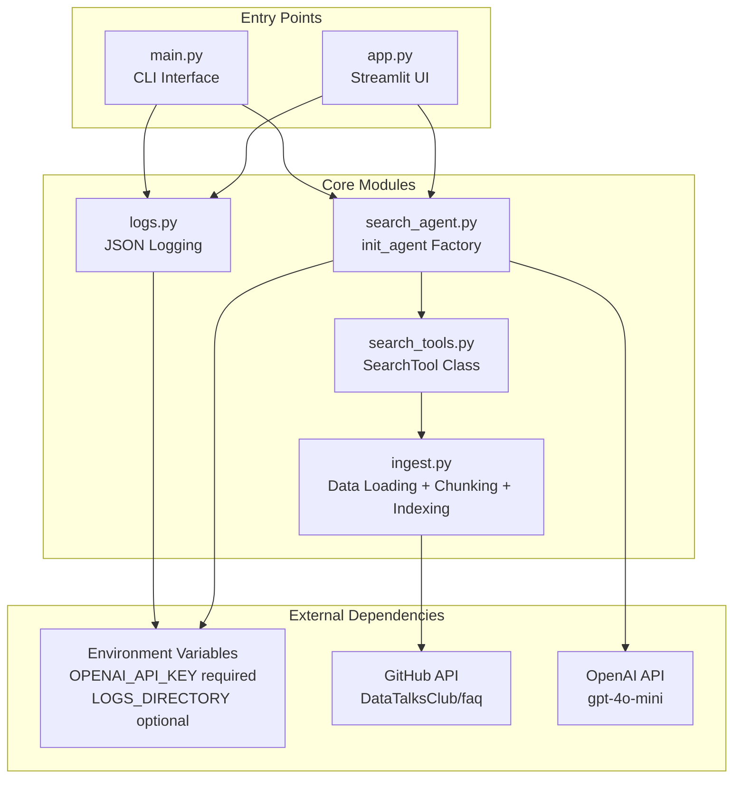

# App Architecture: Module Relationships

**Phase:** 36 (Documentation Verification)
**Purpose:** Document the production app/ folder structure and module dependencies

## Description

Shows the dependency flow between app/ modules, entry points, and external dependencies. This diagram illustrates how both CLI (main.py) and Streamlit (app.py) interfaces share the same core modules, demonstrating clean separation of interface from business logic.

## Architecture Diagram

## Purpose

This diagram visualizes the complete application architecture refactored from Jupyter notebooks in Phase 31. It demonstrates:

1. **Dual Entry Points**: Both CLI and web interfaces use identical business logic
2. **Dependency Injection**: SearchTool receives index via constructor (no globals)
3. **Environment Configuration**: All external dependencies loaded via environment variables
4. **Modular Design**: Each module has a single responsibility

## Key Insight

Both entry points (CLI and Streamlit UI) share the same core modules, demonstrating separation of interface from business logic. The main.py and app.py files are the only places where the default repository (DataTalksClub/faq) is hardcoded, while all core modules accept repository parameters via dependency injection.

## Module Count

**6 Python files verified:**
- ingest.py (data loading, chunking, indexing)
- search_tools.py (SearchTool class)
- search_agent.py (init_agent factory)
- logs.py (JSON logging)
- main.py (CLI entry point)
- app.py (Streamlit entry point)

## Environment Variables

| Variable | Required | Default | Purpose |
|----------|----------|---------|---------|
| OPENAI_API_KEY | Yes | N/A | OpenAI API authentication |
| LOGS_DIRECTORY | No | logs | Directory for JSON interaction logs |

**Note:** Environment variables are validated in logs.py at module load time. Missing OPENAI_API_KEY causes immediate failure with clear error message: "OPENAI_API_KEY environment variable required. Set in .env file or export in shell."

## Dependencies Between Modules

### Entry Point Layer
- **main.py**: Imports ingest, search_agent, logs
- **app.py**: Imports main (reuses initialize_index/initialize_agent), logs

### Core Logic Layer
- **search_agent.py**: Imports search_tools
- **search_tools.py**: Imports minsearch.Index (external)
- **ingest.py**: No internal dependencies (base layer)
- **logs.py**: No internal dependencies (utility layer)

### Dependency Hierarchy (Bottom to Top)
1. **Base**: ingest.py, logs.py (no internal dependencies)
2. **Tools**: search_tools.py (depends on ingest via Index)
3. **Agent**: search_agent.py (depends on search_tools)
4. **Entry Points**: main.py, app.py (depend on agent layer)

## External Dependencies

- **minsearch**: Text-based search index (TF-IDF)
- **pydantic-ai**: Agent framework with tool registration
- **tiktoken**: Token counting (cl100k_base encoding for GPT-4/3.5)
- **frontmatter**: YAML frontmatter parsing
- **requests**: GitHub API downloads
- **streamlit**: Web UI framework (app.py only)

---

**Created:** 2026-04-17
**Milestone:** v6.0 Day 6 - Publish Your Agent
**Requirements:** DOC-04, DOC-05
