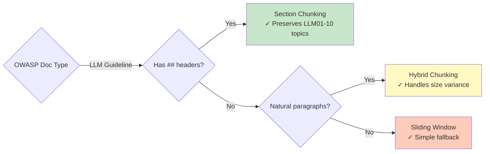

# Phase 11: Hybrid Chunking & OWASP Analysis

```mermaid
flowchart TD
    Start([Input: OWASP docs<br/>542 markdown files]) --> ExistingWork[Existing implementations:<br/>- Sliding window<br/>- Paragraph<br/>- Section<br/>All with type hints + docstrings]

    ExistingWork --> HybridDev[Develop hybrid strategy]

    subgraph HybridStrategy ["Hybrid: Paragraph + Sliding Window"]
        H1[Split document by \\n\\s*\\n] --> H2[For each paragraph]
        H2 --> H3{Paragraph size > threshold?}
        H3 -->|No| H4[Keep paragraph as-is<br/>Preserves natural boundary]
        H3 -->|Yes| H5[Apply sliding window to paragraph<br/>chunk_size=2000, overlap=1000]
        H4 --> H6[Add to chunks list]
        H5 --> H6
        H6 --> H7{More paragraphs?}
        H7 -->|Yes| H2
        H7 -->|No| H8[Return chunks]
    end

    HybridDev --> H1

    H8 --> ApplyAll[Apply all 4 strategies to OWASP corpus]

    ApplyAll --> Metrics[Collect metrics:<br/>Strategy | Chunks | Avg Tokens | P95 Size]

    Metrics --> Results[Quantitative Results:<br/>- Sliding window: 3,563 chunks<br/>- Paragraph: 14,254 chunks<br/>- Section: 1,023 chunks<br/>- Hybrid: 14,745 chunks]

    Results --> Analysis[OWASP-Specific Analysis]

    subgraph AnalysisPhase ["Three-Section Analysis"]
        A1[Section 1: Quantitative Comparison<br/>Reference actual metrics,<br/>interpret for OWASP use case]
        A2[Section 2: Strategy Recommendation<br/>Primary: Section chunking<br/>Rationale: ## structure<br/>Alternatives: When to use others]
        A3[Section 3: Decision Framework<br/>Generalized decision tree<br/>OWASP-specific: 'If ## headers → section'<br/>Contrast with course examples]

        A1 --> A2
        A2 --> A3
    end

    Analysis --> A1
    A3 --> Findings

    Findings[Key Findings] --> F1[OWASP characteristics:<br/>- Heavy ## structure LLM01-10<br/>- Security topic boundaries<br/>- Nested ### preserved]
    F1 --> F2[Section chunking best:<br/>- Preserves LLM01, LLM02 topics<br/>- Moderate sizes median 1598 chars<br/>- Includes nested subsections]
    F2 --> F3[Hybrid improves paragraph:<br/>- Handles oversized paragraphs<br/>- Triggered for 491 large chunks<br/>- Predictable max size now]

    F3 --> End([Output: Hybrid implementation<br/>+ OWASP recommendation<br/>+ Decision framework])

    style Start fill:#e1f5fe
    style End fill:#e1f5fe
    style Results fill:#c8e6c9
    style Findings fill:#fff9c4
```

## Hybrid Strategy Design

### Algorithm
```python
def chunk_paragraph_with_sliding_window(
    doc: dict[str, Any],
    max_paragraph_size: int = 2000,
    chunk_size: int = 2000,
    overlap: int = 1000
) -> list[dict[str, Any]]:
    """Paragraph-first with sliding window fallback for oversized paragraphs.

    Args:
        doc: Document dict with 'content' and metadata
        max_paragraph_size: Threshold to trigger sliding window
        chunk_size: Window size for oversized paragraphs
        overlap: Overlap size for sliding window

    Returns:
        List of chunk dicts with metadata preserved
    """
    # Split by paragraph boundaries
    paragraphs = re.split(r'\n\s*\n', doc['content'])
    chunks = []

    for paragraph in paragraphs:
        if len(paragraph) <= max_paragraph_size:
            # Keep as-is (preserves natural boundary)
            chunks.append({**doc, 'content': paragraph})
        else:
            # Apply sliding window to oversized paragraph
            sub_chunks = chunk_sliding_window(
                {**doc, 'content': paragraph},
                chunk_size,
                overlap
            )
            chunks.extend(sub_chunks)

    return chunks
```

### OWASP Results
- **Total chunks:** 14,745 (vs 14,254 pure paragraph)
- **Oversized paragraphs handled:** 491 large chunks split
- **Max chunk size:** 2,000 chars (vs 43K for pure paragraph)
- **Natural boundaries preserved:** 14,254 paragraphs kept intact

## OWASP-Specific Findings

### Document Structure
```
LLM01: Prompt Injection
├── ## Description        (Section chunk 1)
├── ## Common Examples    (Section chunk 2)
├── ## Prevention Measures (Section chunk 3)
│   ├── ### Input Validation   (nested in chunk 3)
│   └── ### Output Encoding    (nested in chunk 3)
└── ## References         (Section chunk 4)
```

### Strategy Recommendation

**✅ Section chunking recommended for OWASP**

**Rationale:**
1. Clear `## ` structure (LLM01, LLM02, ..., LLM10)
2. Preserves security topic boundaries
3. Nested `###` headers stay with parent section
4. Moderate chunk sizes (median 1,598 chars)
5. Self-contained topics (each `## ` is a complete concept)

**When to use alternatives:**

| Strategy | Use for OWASP when... |
|----------|----------------------|
| Sliding Window | Fixed-size embeddings required (e.g., model has 512 token limit) |
| Paragraph | Analyzing blog-style narrative sections (rare in OWASP) |
| Hybrid | Need to handle both structured and unstructured sections |
| LLM | Cost justified by improved retrieval (free tiers make this viable) |

### Decision Framework



### Comparison Table (from notebook)

| Strategy | Chunks | Avg Tokens | Min | P50 | P95 | Max |
|----------|--------|------------|-----|-----|-----|-----|
| Sliding Window | 3,563 | 553 | 1 | 547 | 721 | 730 |
| Paragraph | 14,254 | 75 | 1 | 41 | 312 | 11,279 |
| Section | 1,023 | 1,045 | 10 | 426 | 3,158 | 11,502 |
| Hybrid | 14,745 | 73 | 1 | 41 | 312 | 547 |

**Key observations:**
- Section chunking: Fewest chunks, highest avg quality
- Paragraph: Most chunks, extreme variance
- Hybrid: Fixes max size issue (547 vs 11,279)
- Sliding window: Most predictable, ignores structure

## Engineering Standards Applied

All chunking functions follow PROJ-08 requirements:
- ✅ Type hints on all signatures
- ✅ Google-style docstrings (Args, Returns, Raises, Example)
- ✅ Input validation with specific error messages
- ✅ Deep copy for metadata preservation
- ✅ No hardcoded values (configurable parameters)
