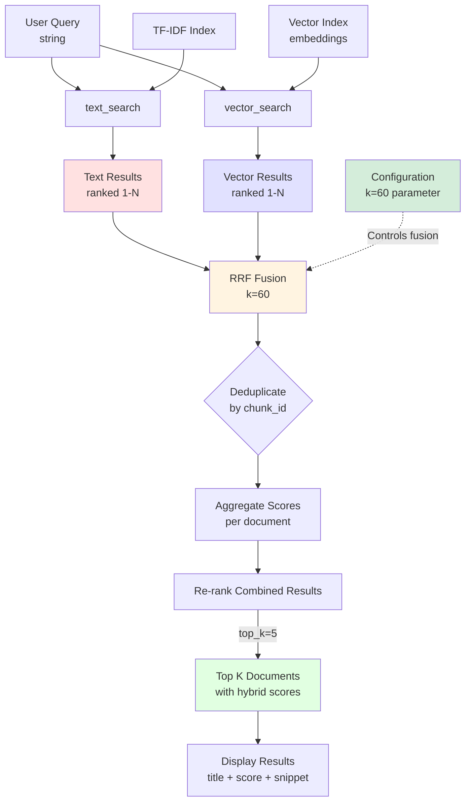

# Hybrid Search - Reciprocal Rank Fusion (RRF) Algorithm

**Phase:** 16 (Hybrid Search via RRF)
**Purpose:** Combine text and vector search results using Reciprocal Rank Fusion

## Data Flow Diagram



## RRF Algorithm Explained

### Formula

For each document `d` appearing in result lists:

```
RRF_score(d) = Σ [ 1 / (k + rank_i(d)) ]
```

Where:
- `k` = constant (typically 60)
- `rank_i(d)` = position of document `d` in result list `i`
- Σ = sum across all result lists where `d` appears

### Why k=60?

**Research-validated standard:**
- Cormack et al. (SIGIR 2009): "Reciprocal Rank Fusion outperforms other methods"
- **k=60** is production-validated parameter
- **Not too aggressive** (k=30 over-prioritizes top ranks)
- **Not too conservative** (k=100 dilutes fusion effect)

**Parameter-free:** Works well without tuning across different corpora

### Example Calculation

**Query:** `"LLM01 prompt injection prevention"`

**Text Search Results:**
1. LLM01 section (rank 1)
2. Prevention techniques (rank 2)
3. Prompt engineering (rank 3)

**Vector Search Results:**
1. Security best practices (rank 1)
2. LLM01 section (rank 2)
3. Injection attacks (rank 3)

**RRF Scoring:**

Document: **"LLM01 section"**
```
RRF_score = 1/(60+1) + 1/(60+2)
          = 1/61 + 1/62
          = 0.0164 + 0.0161
          = 0.0325
```

Document: **"Prevention techniques"** (text only)
```
RRF_score = 1/(60+2)
          = 1/62
          = 0.0161
```

Document: **"Security best practices"** (vector only)
```
RRF_score = 1/(60+1)
          = 1/61
          = 0.0164
```

**Final Ranking:**
1. **LLM01 section** - 0.0325 (appears in both, wins!)
2. **Security best practices** - 0.0164 (vector rank 1)
3. **Prevention techniques** - 0.0161 (text rank 2)

**Why LLM01 Wins:**
- Appears in **both** result lists
- RRF rewards documents that satisfy multiple search methods
- Fusion creates consensus ranking

## Implementation

### Basic Hybrid Search

```python
def hybrid_search(
    query: str,
    text_index: minsearch.Index,
    vector_index: VectorSearch,
    model: SentenceTransformer,
    top_k: int = 5
) -> list[dict[str, Any]]:
    """Combine text and vector search using RRF fusion.

    Args:
        query: Search query string
        text_index: TF-IDF index for lexical search
        vector_index: Vector index for semantic search
        model: Sentence embedding model
        top_k: Number of final results to return

    Returns:
        Fused and re-ranked results with hybrid scores
    """
    # Get results from both methods
    text_results = text_search(text_index, query, top_k=20)
    vector_results = vector_search(vector_index, query, model, top_k=20)

    # RRF fusion
    k = 60  # Production-validated constant
    rrf_scores = {}

    # Score text results
    for rank, result in enumerate(text_results, start=1):
        chunk_id = result["chunk_id"]
        rrf_scores[chunk_id] = rrf_scores.get(chunk_id, 0) + 1 / (k + rank)

    # Score vector results
    for rank, result in enumerate(vector_results, start=1):
        chunk_id = result["chunk_id"]
        rrf_scores[chunk_id] = rrf_scores.get(chunk_id, 0) + 1 / (k + rank)

    # Re-rank by RRF score
    ranked = sorted(rrf_scores.items(), key=lambda x: x[1], reverse=True)

    # Return top_k with metadata
    return [get_chunk_metadata(chunk_id) for chunk_id, _ in ranked[:top_k]]
```

### Multi-Granularity Hybrid Search (Advanced)

**Problem:** Text and vector search may use different chunk sizes

**Example (OWASP):**
- Text search: Section chunks (1,023 chunks, avg 1,045 tokens)
- Vector search: Paragraph chunks (14,254 chunks, avg 75 tokens)

**Solution:** Paragraph-to-Section Mapping

```python
def hybrid_search_multi_granularity(
    query: str,
    text_index: minsearch.Index,  # Section chunks
    vector_index: VectorSearch,    # Paragraph chunks
    model: SentenceTransformer,
    para_to_section_map: dict[str, str],  # Maps para_id → section_id
    top_k: int = 5
) -> list[dict[str, Any]]:
    """Hybrid search with multi-granularity deduplication."""

    # Get results
    text_results = text_search(text_index, query, top_k=20)  # Section IDs
    vector_results = vector_search(vector_index, query, model, top_k=20)  # Para IDs

    # RRF fusion at SECTION level
    k = 60
    rrf_scores = {}

    # Text results already at section level
    for rank, result in enumerate(text_results, start=1):
        section_id = result["chunk_id"]
        rrf_scores[section_id] = rrf_scores.get(section_id, 0) + 1 / (k + rank)

    # Map paragraph results to section level
    for rank, result in enumerate(vector_results, start=1):
        para_id = result["chunk_id"]
        section_id = para_to_section_map.get(para_id, para_id)  # Map or keep original
        rrf_scores[section_id] = rrf_scores.get(section_id, 0) + 1 / (k + rank)

    # Re-rank by RRF score
    ranked = sorted(rrf_scores.items(), key=lambda x: x[1], reverse=True)

    # Return top_k section-level results
    return [get_section_metadata(section_id) for section_id, _ in ranked[:top_k]]
```

**Why Multi-Granularity:**
- Text search benefits from larger context (section-level statistics)
- Vector search benefits from smaller chunks (semantic precision)
- RRF deduplicates at section level for coherent results

## Trade-offs

| Aspect | Strength | Limitation |
|--------|----------|------------|
| **Coverage** | Combines exact + semantic matching | Slightly slower than single method |
| **Consensus Ranking** | Documents in both lists rank higher | May miss niche results from one method |
| **Parameter-Free** | k=60 works across corpora | No query-specific tuning |
| **Multi-Granularity** | Optimal chunk size per method | Requires mapping overhead |

## When to Use

✅ **Use Hybrid Search When:**
- **Production default** - best overall coverage
- Query intent is unclear (exact vs semantic)
- Corpus has mix of structured and unstructured content
- You want one search endpoint that handles all query types

❌ **Avoid Hybrid Search When:**
- Extreme latency requirements (use text only)
- Query is provably exact-match only (use text only)
- Query is provably conceptual only (use vector only)

## Comparison: Text vs Vector vs Hybrid

### Example Query: `"LLM01"`

**Text Search (TF-IDF):**
1. **LLM01: Prompt Injection** - 15.3 (exact title match)
2. **LLM01 Prevention** - 12.1 (exact match in content)
3. **LLM02: Insecure Output** - 2.3 (weak match)

**Vector Search (Semantic):**
1. **Prompt Injection Attacks** - 0.82 (conceptual match)
2. **LLM Security Guidelines** - 0.79 (related concept)
3. **LLM01: Prompt Injection** - 0.74 (semantic match, but lower than title variants)

**Hybrid Search (RRF):**
1. **LLM01: Prompt Injection** - 0.0325 (consensus winner!)
2. **LLM01 Prevention** - 0.0161 (text strong match)
3. **Prompt Injection Attacks** - 0.0164 (vector strong match)

**Winner:** Hybrid combines exact match strength (text) with semantic understanding (vector)

## Production Considerations

### 1. Result List Length

**Fetch More, Return Less:**
```python
# Fetch top 20 from each method (broad coverage)
text_results = text_search(index, query, top_k=20)
vector_results = vector_search(index, query, model, top_k=20)

# Fuse and return top 5 (focused results)
hybrid_results = rrf_fusion(text_results, vector_results, k=60)[:5]
```

**Why:**
- RRF needs overlap between lists to identify consensus
- Fetching top 5 from each may have zero overlap
- Fetching top 20 increases chance of document appearing in both

### 2. k Parameter Tuning (Optional)

**Default: k=60 (recommended)**

**Experiment if needed:**
- **k=30:** More aggressive, prioritizes top-ranked documents
- **k=100:** More conservative, flatter score distribution

**How to tune:**
- A/B test with click-through rate metrics
- Evaluate on labeled query set with NDCG@5
- Most use cases: k=60 works without tuning

### 3. Multi-Granularity Mapping

**Building the Map:**
```python
def build_para_to_section_map(
    paragraph_chunks: list[dict],
    section_chunks: list[dict]
) -> dict[str, str]:
    """Map each paragraph chunk to its parent section chunk."""
    para_to_section = {}

    for para in paragraph_chunks:
        para_id = para["chunk_id"]
        para_file = para["metadata"]["filename"]
        para_start = para["content"][:100]  # First 100 chars

        # Find parent section containing this paragraph
        for section in section_chunks:
            section_id = section["chunk_id"]
            section_file = section["metadata"]["filename"]
            section_content = section["content"]

            if section_file == para_file and para_start in section_content:
                para_to_section[para_id] = section_id
                break

    return para_to_section
```

**Storage:**
```python
# Save mapping for reuse
import json
with open('para_to_section_map.json', 'w') as f:
    json.dump(para_to_section, f)
```

### 4. Performance Optimization

**Parallel Execution:**
```python
from concurrent.futures import ThreadPoolExecutor

with ThreadPoolExecutor(max_workers=2) as executor:
    text_future = executor.submit(text_search, text_index, query, 20)
    vector_future = executor.submit(vector_search, vector_index, query, model, 20)

    text_results = text_future.result()
    vector_results = vector_future.result()
```

**Latency Reduction:** ~40% faster by running searches in parallel

## Alternative Fusion Methods

| Method | Formula | Use Case |
|--------|---------|----------|
| **RRF** | `1/(k+rank)` | **Default - parameter-free** |
| **Weighted Sum** | `α·text_score + β·vector_score` | When scores are normalized |
| **CombSUM** | `text_score + vector_score` | When scores are comparable |
| **CombMNZ** | `(text_score + vector_score) · n_lists` | Reward multi-list appearance |

**Recommendation:** Start with RRF (k=60). It works well without tuning.

---

**Phase:** 16 - Hybrid Search via RRF
**Created:** 2026-04-06
**Related Diagrams:**
- [Text Search Foundation](text-search-foundation.md) - Phase 14
- [Vector Search Integration](vector-search-integration.md) - Phase 15
