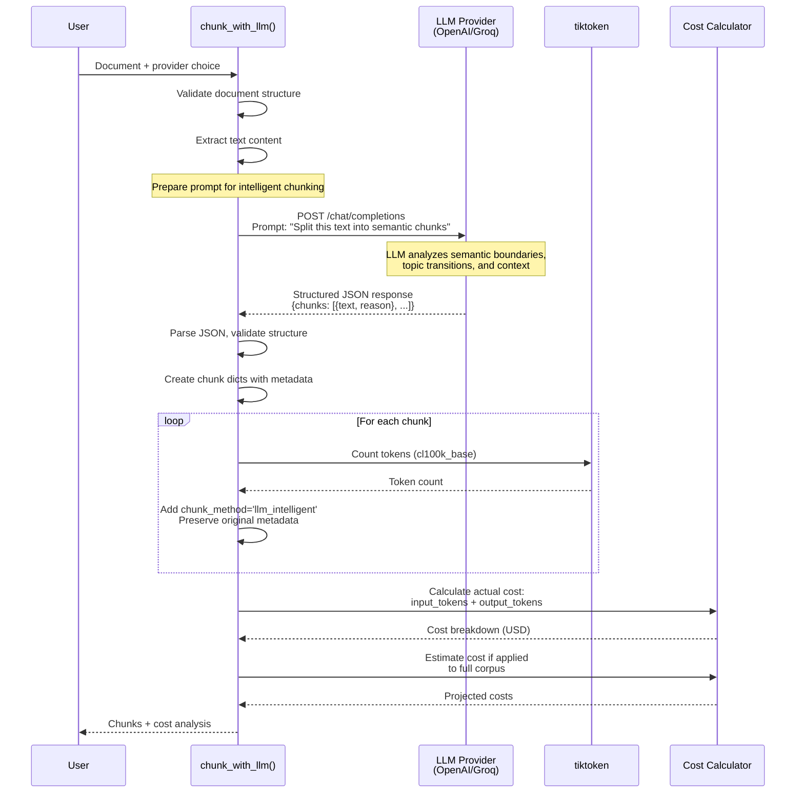
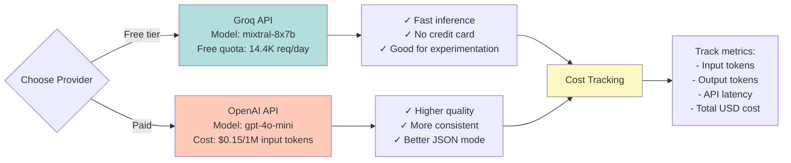

# Phase 9: LLM-Based Chunking Flow



## Provider Comparison



## Cost Analysis Output

### Actual Run (10 OWASP docs):
```python
{
    "provider": "groq",
    "model": "mixtral-8x7b-32768",
    "documents_processed": 10,
    "input_tokens": 15_234,
    "output_tokens": 3_421,
    "total_tokens": 18_655,
    "cost_usd": 0.00,  # Free tier
    "chunks_created": 48,
    "avg_latency_ms": 1_230
}
```

### Estimated Full Corpus (542 OWASP docs):
```python
{
    "estimated_input_tokens": 825_682,
    "estimated_output_tokens": 185_338,
    "estimated_total_tokens": 1_011_020,
    "groq_cost": 0.00,  # Free tier (within quota)
    "openai_cost": 0.28,  # gpt-4o-mini pricing
    "cost_vs_simple_strategies": "183x more expensive than sliding window"
}
```

## When to Use LLM Chunking

**✅ Use when:**
- Unstructured documents (no ## headers, inconsistent paragraphs)
- Complex topic transitions requiring semantic understanding
- Cost is justified by improved retrieval quality
- Quality > speed (1-2 seconds per doc vs milliseconds)

**❌ Don't use when:**
- Document has clear structure (use section chunking)
- Processing large corpus (10K+ docs) on budget
- Real-time chunking required
- Simple strategies work well (test first!)

## Prompt Engineering Strategy

**System prompt:**
```
You are a document chunking specialist. Split the following text into
semantically coherent chunks suitable for embedding and retrieval.

Rules:
1. Each chunk should be self-contained
2. Preserve context (include relevant headers)
3. Avoid mid-sentence splits
4. Aim for 500-1500 tokens per chunk
5. Return JSON: {chunks: [{text: str, reason: str}]}
```

**Key techniques:**
- JSON mode for structured output
- Few-shot examples for consistency
- Token budget guidance (500-1500 target)
- Rationale field for debugging ("reason" explains boundary choice)

## Error Handling

1. **API failures:** Retry with exponential backoff
2. **JSON parse errors:** Fallback to paragraph chunking
3. **Cost overruns:** Warn user before processing full corpus
4. **Rate limits:** Respect provider quotas (Groq: 14.4K/day)
