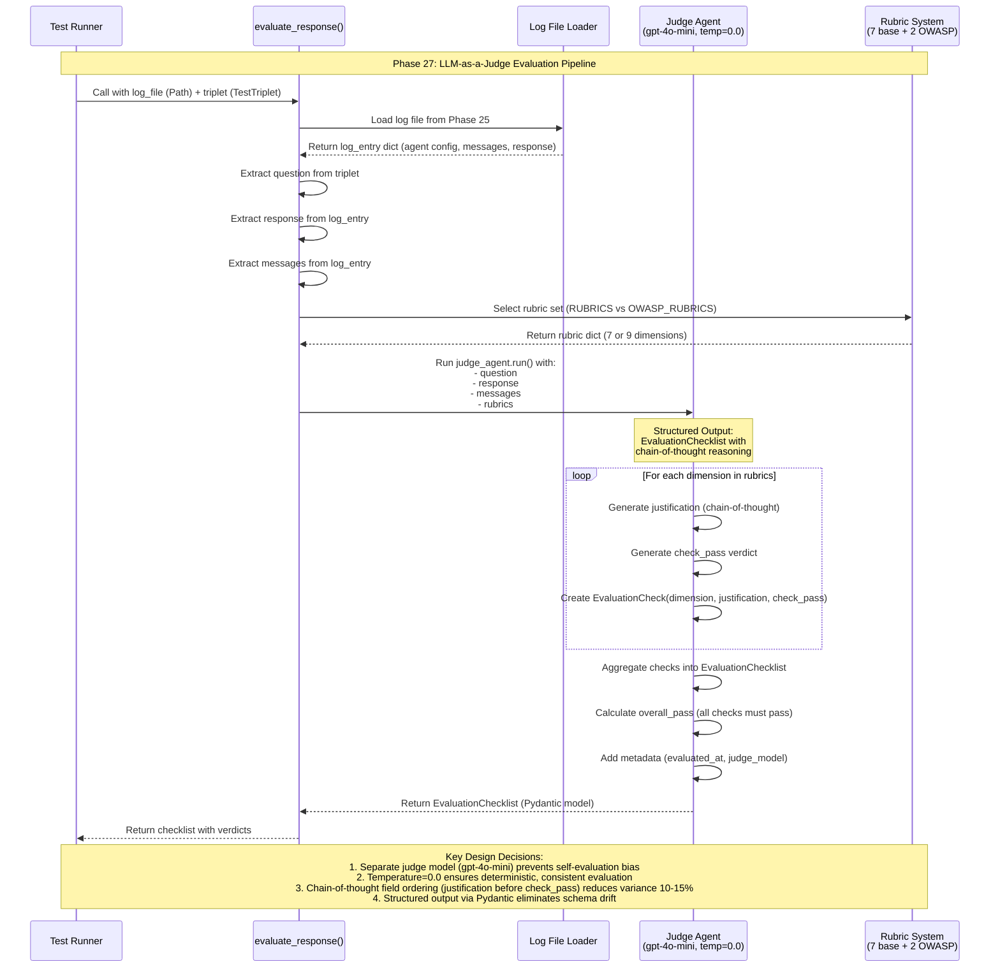

# LLM-as-a-Judge Evaluation Flow (Phase 27)

## Flow Description

### Inputs
- **log_file** (Path): JSON log from Phase 25 (`aihero.logging.log_interaction_to_file()`)
- **triplet** (TestTriplet): Test data from Phase 26 with question, expected answer, source files

### Processing Steps

1. **Load Log Data** - Read JSON log file containing agent configuration, message history, and response
2. **Extract Context** - Pull question, response, and message history from log and triplet
3. **Select Rubrics** - Choose RUBRICS (7 dimensions) or OWASP_RUBRICS (9 dimensions) based on context
4. **Judge Invocation** - Call `judge_agent.run()` with structured output type `EvaluationChecklist`
5. **Chain-of-Thought Evaluation** - For each dimension:
   - LLM generates justification first (reasoning)
   - Then generates check_pass verdict (true/false)
   - Field order in schema enforces this sequence
6. **Aggregate Results** - Combine all EvaluationCheck objects into EvaluationChecklist
7. **Calculate Overall** - overall_pass = true if ALL checks pass

### Output
- **EvaluationChecklist** (Pydantic model):
  - `checks`: List of EvaluationCheck objects (one per dimension)
  - `overall_pass`: Boolean (requires all dimensions to pass)
  - `evaluated_at`: ISO timestamp
  - `judge_model`: Model identifier (e.g., "openai:gpt-4o-mini")

### Key Design Decisions

| Decision | Rationale | Impact |
|----------|-----------|--------|
| **Separate Judge Model** | Use gpt-4o-mini instead of FAQ agent's gpt-5-nano | Prevents self-evaluation bias |
| **Temperature=0.0** | Deterministic evaluation settings | Consistent, reproducible verdicts |
| **Chain-of-Thought Ordering** | justification field BEFORE check_pass in schema | 10-15% reduction in evaluation variance |
| **Structured Output** | Pydantic BaseModel with auto-validation | Eliminates schema drift and parsing errors |
| **Dual Rubrics** | RUBRICS (7 dims) + OWASP_RUBRICS (9 dims) | Course context uses base, project adds security |

### Evaluation Dimensions

**Base Rubrics (7 dimensions):**
1. instructions_follow - Follows system prompt guidelines
2. instructions_avoid - Avoids prohibited behaviors
3. answer_relevant - Addresses the question asked
4. answer_clear - Comprehensible and well-structured
5. answer_citations - Accurate source attribution
6. completeness - Comprehensive coverage
7. tool_call_search - Appropriate tool usage

**OWASP Extensions (2 additional):**
8. security_correctness - Factually accurate security information
9. cve_citation_accuracy - Correct CVE and OWASP category references

## Integration Points

### Phase 25 (Logging)
- **Input Dependency**: Reads log files from `logs/` directory
- **Format**: JSON with timestamp, agent config, messages, response
- **File Pattern**: `{agent_name}_{YYYYMMDD_HHMMSS}_{hex}.json`

### Phase 26 (Test Data)
- **Input Dependency**: Reads TestTriplet with question and expected answer
- **Source Tracking**: 'user' (manual) vs 'ai-generated' (synthetic)
- **Validation**: All triplets validated via `validate_test_set()`

### Future Phases
- **Metrics Calculation**: Aggregate EvaluationChecklist results into pass rates
- **Experiment Tracking**: Store evaluation results with experiment metadata
- **Continuous Evaluation**: Run judge on new agent outputs automatically
