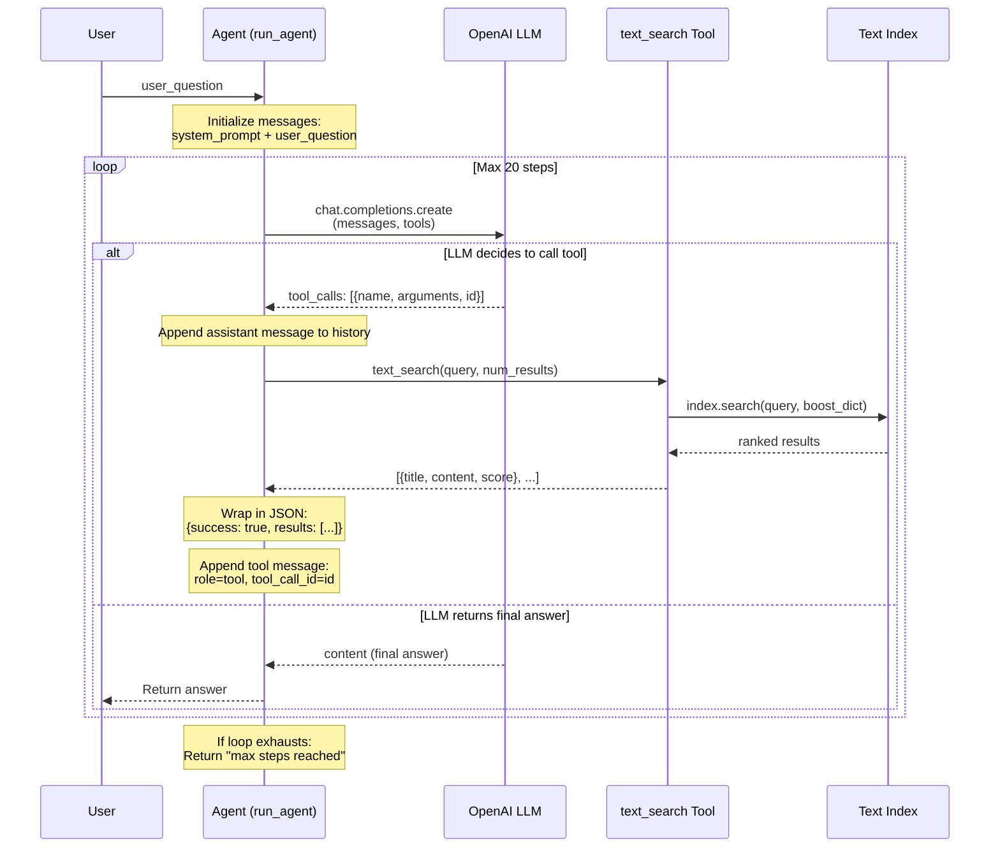
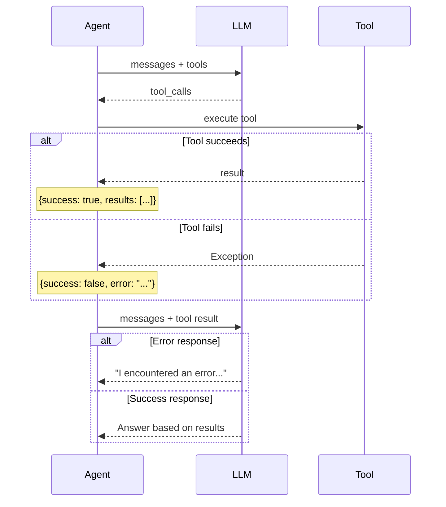

# Manual Agent Loop Flow - OpenAI Function Calling

**Phase:** 20 (Manual OpenAI Agent)
**Purpose:** Demonstrate the agent loop pattern using raw OpenAI API

## Sequence Diagram



## Flow Description

### Step 1: User Input
User asks a question (e.g., "What is Docker used for in the course?")

### Step 2: Initialize Messages
Agent creates message array:
```python
messages = [
    {"role": "system", "content": system_prompt},
    {"role": "user", "content": user_question}
]
```

### Step 3: LLM Decision
LLM receives messages + tool schemas, decides to:
- **Call a tool**: Returns `tool_calls` array with function name and arguments
- **Return answer**: Returns `content` with final response

### Step 4: Tool Execution (if tool called)
Agent executes the tool:
```python
result = text_search(query=args["query"], num_results=args.get("num_results", 5))
```

### Step 5: Append Tool Result
Agent adds tool result to history:
```python
messages.append({
    "role": "tool",
    "content": json.dumps({"success": True, "results": result}),
    "tool_call_id": tool_call.id  # Must match original call
})
```

### Step 6: Continue Loop
Loop back to Step 3 with updated messages. LLM now sees:
- System prompt
- User question
- Its own tool call request
- Tool execution result

### Step 7: Final Answer
When LLM has enough information, it returns `content` (no `tool_calls`).
Agent returns this to user.

## Key Design Decisions

| Decision | Rationale |
|----------|-----------|
| Max 20 steps | Prevents infinite loops (token cost + hang prevention) |
| Strict mode | Guarantees tool arguments match schema |
| Error as JSON | Feeds errors to LLM for graceful recovery |
| tool_call_id | Correlates results with requests (required by API) |

## Error Handling Flow



## Message Array Evolution

| After Step | Messages Array |
|------------|---------------|
| User input | [system, user] |
| LLM tool call | [system, user, assistant{tool_calls}] |
| Tool result | [system, user, assistant{tool_calls}, tool{result}] |
| Final answer | [system, user, assistant{tool_calls}, tool{result}] + response |

## Stateless Pattern

**Critical insight:** LLMs have no memory. Every API call sends the FULL message array.

```
Call 1: [system, user] -> LLM -> tool_calls
Call 2: [system, user, assistant, tool] -> LLM -> final answer
```

The LLM "remembers" because we send the entire conversation history.

## Requirements Mapped

| Requirement | Implementation |
|-------------|---------------|
| AGENT-01 | Tool schema with strict mode |
| AGENT-02 | Loop calling chat.completions.create |
| AGENT-03 | System prompt with behavior rules |
| AGENT-04 | Messages array management |
| AGENT-05 | json.dumps for tool responses |
| AGENT-07 | try/except with error JSON |
| AGENT-08 | max_steps=20 termination |

---

**Phase:** 20 - Manual OpenAI Agent
**Created:** 2026-04-07
**Related:**
- [Text Search Foundation](text-search-foundation.md) - Day 3 search used as tool
- [Agent Tool Architecture](agent-tool-architecture.md) - Phase 24 full architecture
