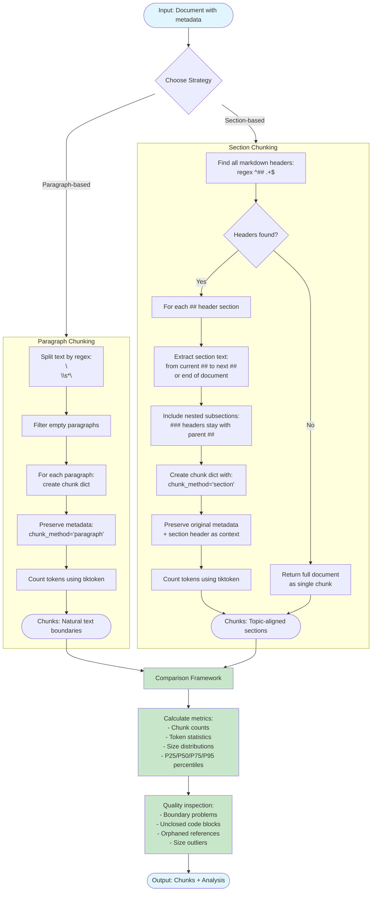

# Phase 8: Semantic Chunking Flow



## Strategy Comparison

### Paragraph Chunking
**Pattern:** `\n\s*\n` (double newlines)

**Strengths:**
- Respects natural text boundaries
- Preserves thought units
- No mid-sentence splits

**Trade-offs:**
- Variable chunk sizes (3-15K chars observed)
- Some paragraphs too large for embeddings
- Many tiny chunks (single-line paragraphs)

**OWASP Results:**
- 14,254 chunks (vs 3,563 sliding window)
- Avg 75 tokens per chunk
- Max 43,195 tokens (single huge paragraph)

### Section Chunking
**Pattern:** `^## ` (markdown level-2 headers)

**Strengths:**
- Preserves document structure
- Topic-aligned boundaries
- Includes nested subsections (### headers)
- Moderate, predictable sizes

**Trade-offs:**
- Requires structured markdown
- Unstructured docs → single chunk
- Section size depends on author style

**OWASP Results:**
- 1,023 chunks
- Avg 1,045 tokens per chunk
- Median 1,598 chars
- Preserves LLM01, LLM02, etc. topic boundaries

## Comparison Framework Features

**Metrics calculated:**
1. **Counts:** Total chunks per strategy
2. **Token stats:** Mean, median, P25/P75/P95
3. **Size distribution:** Character count percentiles
4. **Efficiency:** Chunks per document

**Quality checks:**
1. **Boundary problems:** Mid-code-block splits
2. **Unclosed blocks:** Orphaned ``` or """
3. **Orphaned references:** Dangling [links] or footnotes
4. **Size outliers:** Chunks >10K chars or <50 chars

## Helper Functions

- `compare_chunking_strategies()` - Multi-metric comparison table
- `inspect_chunk_quality()` - Automated quality detection
- `show_sample_chunks()` - Manual inspection interface
