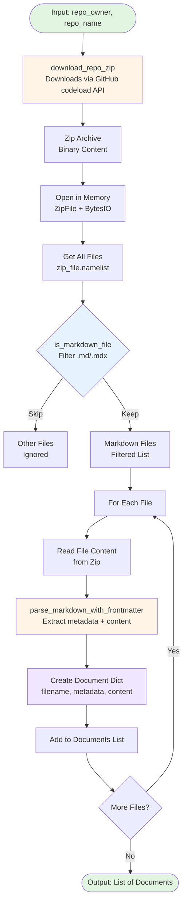

# Phase 3: GitHub Ingestion Data Flow

This diagram shows the data transformation pipeline implemented in Phase 3 (Core Implementation). The `read_repo_data()` function orchestrates multiple helper functions to transform a GitHub repository into structured documentation ready for RAG indexing.

## Pipeline Architecture



## Data Transformation Steps

| Step | Function | Input | Output | Purpose |
|------|----------|-------|--------|---------|
| 1 | `download_repo_zip` | repo_owner, repo_name | bytes | Downloads repository as zip via GitHub API |
| 2 | `ZipFile + BytesIO` | zip bytes | ZipFile object | Opens archive in memory (no disk I/O) |
| 3 | `namelist()` | ZipFile | List[str] | Lists all files in archive |
| 4 | `is_markdown_file` | filename | bool | Filters for .md/.mdx extensions |
| 5 | `zip_file.read()` | filename | bytes | Reads individual file content |
| 6 | `parse_markdown_with_frontmatter` | content bytes | {metadata, content} | Extracts YAML frontmatter and markdown |
| 7 | Document structuring | parsed data | dict | Creates consistent schema |
| 8 | Accumulation | document dict | List[dict] | Collects all processed documents |

## Key Design Decisions

### In-Memory Processing
- **Why:** Avoids disk I/O overhead for batch operations
- **How:** `ZipFile(BytesIO(response.content))`
- **Benefit:** Faster processing, no cleanup needed

### Frontmatter Handling
- **Library:** python-frontmatter
- **Graceful degradation:** Returns empty `{}` if no frontmatter present
- **Enables:** Universal pipeline that works with and without metadata

### Structured Output Schema
```python
{
    'filename': str,     # Path within repository
    'metadata': dict,    # YAML frontmatter (or {})
    'content': str       # Markdown content
}
```

**Consistency:** Same schema regardless of source repository structure, frontmatter presence, or file organization.

## Pipeline Characteristics

| Characteristic | Value | Impact |
|----------------|-------|--------|
| **Disk I/O** | None | Faster processing |
| **Memory Usage** | Single zip in RAM | Scalable to ~100MB repos |
| **Parallelizable** | No (single repo at a time) | Could batch multiple repos |
| **Error Handling** | Fail-fast on HTTP errors | Caller handles retry logic |
| **File Filtering** | Extension-based (.md/.mdx) | Ignores images, code, config |

## RAG Pipeline Integration

This ingestion step is the **first stage** of a complete RAG pipeline:

```
GitHub Repo
    ↓
[PHASE 3: Ingest] ← You are here
    ↓
Structured Documents (filename, metadata, content)
    ↓
[DAY 2: Chunk]
    ↓
Document Chunks
    ↓
[DAY 3: Embed]
    ↓
Vector Embeddings
    ↓
[DAY 3: Index]
    ↓
Vector Database
    ↓
[DAY 4: Query]
    ↓
Retrieved Context
    ↓
[DAY 4: Generate]
    ↓
LLM Response
```

**Why This Stage Matters:**
- Clean, consistent input makes every downstream stage easier
- Structured metadata improves retrieval precision
- Universal design handles diverse documentation conventions

## Implementation Files

- **Course Implementation:** `course/day1.ipynb`
- **Project Implementation:** `project/owasp_homework.ipynb`
- **Test Repositories:** DataTalks FAQ (1,285 docs), Evidently AI (95 docs), OWASP LLM Top 10 (542 docs)

---

*Last Updated: 2026-03-30 | Phase 3 Complete*
