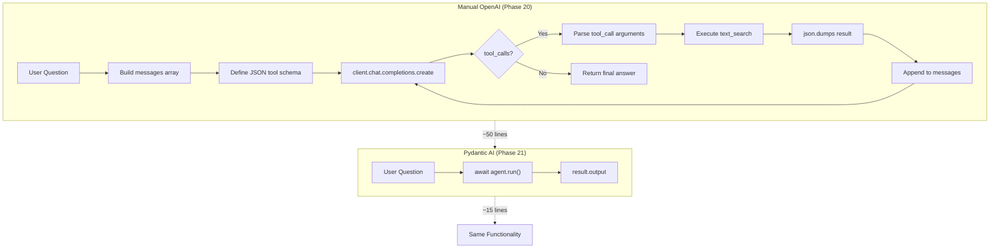
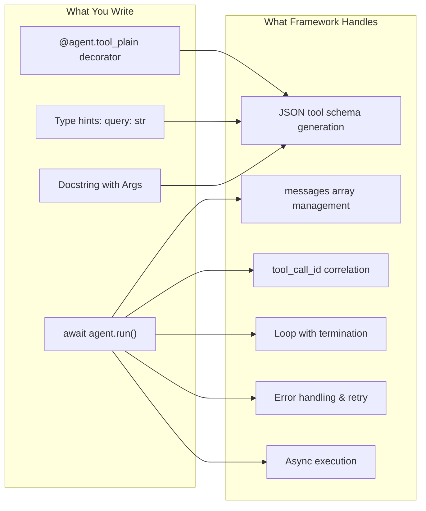
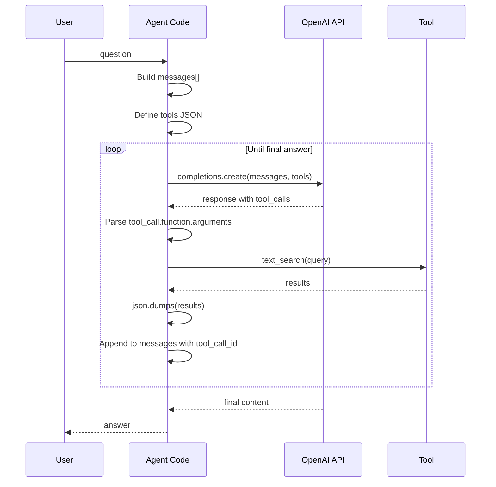
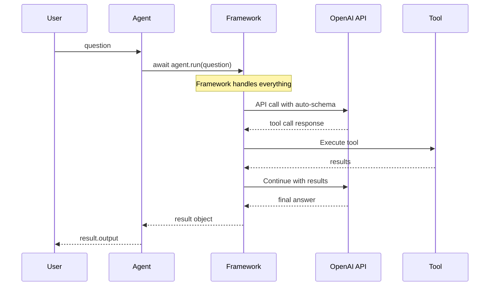

# Manual vs Pydantic AI: Implementation Comparison

**Phase:** 21 (Pydantic AI Framework Migration)
**Purpose:** Demonstrate what Pydantic AI abstracts and the resulting code simplification

## Architecture Comparison



## What Pydantic AI Abstracts



## Code Complexity Comparison

| Component | Manual OpenAI | Pydantic AI | Reduction |
|-----------|---------------|-------------|-----------|
| Tool schema | 15 lines JSON | 0 lines (auto-generated) | 100% |
| Messages array | 10 lines | 0 lines (internal) | 100% |
| Loop logic | 15 lines | 0 lines (built-in) | 100% |
| Error handling | 10 lines | 0 lines (automatic) | 100% |
| Agent definition | 5 lines | 5 lines | 0% |
| Tool function | 10 lines | 10 lines | 0% |
| **Total** | **~50 lines** | **~15 lines** | **~70%** |

## Sequence Comparison

### Manual OpenAI Flow


### Pydantic AI Flow


## Key Abstractions

### 1. Tool Schema Auto-Generation (PYDANTIC-05)

**Manual:**
```python
tools = [{
    "type": "function",
    "function": {
        "name": "text_search",
        "description": "Search FAQ...",
        "parameters": {
            "type": "object",
            "properties": {
                "query": {"type": "string", "description": "..."}
            },
            "required": ["query"]
        }
    }
}]
```

**Pydantic AI:**
```python
@agent.tool_plain
def pydantic_text_search(query: str) -> list[dict]:
    """Search FAQ..."""
    pass
# Schema auto-generated from type hints + docstring!
```

### 2. Conversation History Management (PYDANTIC-02, PYDANTIC-03)

**Manual:**
```python
messages = [
    {"role": "system", "content": system_prompt},
    {"role": "user", "content": question}
]
# After each tool call:
messages.append(assistant_message)
messages.append({
    "role": "tool",
    "content": json.dumps(result),
    "tool_call_id": tool_call.id
})
```

**Pydantic AI:**
```python
result = await agent.run(question)
# History managed internally
# Inspect via result.new_messages()
```

### 3. Reasoning Inspection (PYDANTIC-04)

**Manual:**
```python
# Print messages array manually
for msg in messages:
    print(f"Role: {msg['role']}, Content: {msg.get('content', msg.get('tool_calls'))}")
```

**Pydantic AI:**
```python
# Structured inspection
for message in result.new_messages():
    print(f"Kind: {message.kind}, Parts: {message.parts}")
```

## Trade-offs

| Aspect | Manual OpenAI | Pydantic AI |
|--------|---------------|-------------|
| Control | Full control over every step | Framework decisions |
| Debugging | Inspect messages directly | Debug through abstraction |
| Learning | Educational, reveals internals | Production-focused |
| Flexibility | Any custom logic possible | Standard patterns |
| Maintenance | Update schema + code separately | Single source of truth |
| Type safety | Manual validation | Automatic via type hints |

## When to Choose Each

### Choose Manual When:
- Learning how agents work (educational)
- Need custom loop logic
- Debugging framework issues
- Maximum control required

### Choose Pydantic AI When:
- Building production agents
- Rapid prototyping
- Standard agent patterns
- Want type-safe, maintainable code

## Requirements Mapping

| Requirement | Manual Implementation | Pydantic AI Equivalent |
|-------------|----------------------|------------------------|
| PYDANTIC-02 | N/A | `@agent.tool_plain` decorator (adds to internal tools list) |
| PYDANTIC-03 | N/A | `await agent.run()` |
| PYDANTIC-04 | N/A | `result.new_messages()` |
| PYDANTIC-05 | N/A | Auto-generated from type hints |
| COURSE-03 | N/A | Side-by-side comparison |

---

**Phase:** 21 - Pydantic AI Framework Migration
**Created:** 2026-04-07
**Related:**
- [Manual Agent Loop Flow](manual-agent-loop-flow.md) - Phase 20 detailed sequence
- [Agent Tool Architecture](agent-tool-architecture.md) - Phase 24 full architecture
