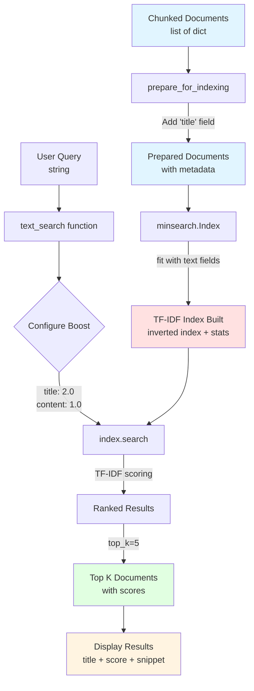

# Text Search Foundation - TF-IDF Indexing Flow

**Phase:** 14 (Text Search Foundation)
**Purpose:** Demonstrate lexical search with TF-IDF scoring and field boosting

## Data Flow Diagram



## Key Components

### Input
- **Chunked Documents:** Output from Day 2 chunking (paragraph, section, or sliding window)
- **Structure:** `list[dict]` with keys: `content`, `metadata`, `chunk_id`

### Transformation: prepare_for_indexing()
**Purpose:** Add `title` field for field boosting

```python
def prepare_for_indexing(chunks: list[dict[str, Any]]) -> list[dict[str, Any]]:
    for chunk in chunks:
        title = chunk.get("metadata", {}).get("title", "Untitled")
        chunk["title"] = title
    return chunks
```

**Why:** minsearch requires explicit fields for boosting. Extracts titles from frontmatter metadata.

### Index: minsearch.Index
**Algorithm:** TF-IDF (Term Frequency-Inverse Document Frequency)

**Configuration:**
```python
index = minsearch.Index(
    text_fields=["title", "content"],  # Fields to search
    keyword_fields=["chunk_id"]         # Exact match fields
)
```

**Index Building:**
```python
index.fit(prepared_chunks)
```

Creates:
1. **Inverted Index:** Maps terms → documents containing them
2. **TF-IDF Statistics:** Term frequency × inverse document frequency
3. **Document Vectors:** Sparse vectors for cosine similarity

### Search: text_search()
**Parameters:**
- `query`: Search string
- `boost_dict`: Field weights (e.g., `{"title": 2.0, "content": 1.0}`)
- `top_k`: Number of results to return

**Scoring:**
```
score = TF-IDF(term, doc) × boost_factor
```

**Field Boosting Rationale:**
- `title: 2.0` - Titles contain key terms (e.g., "Docker", "LLM01")
- `content: 1.0` - Baseline content relevance

### Output
- **Ranked Results:** List of dicts with `title`, `content`, `score`, `chunk_id`
- **Sorted:** Descending by TF-IDF score

## Example: DataTalks FAQ

**Query:** `"Docker"`

**Text Search Results:**
1. **Title:** "How do I run Docker on Mac?" - Score: 15.3
2. **Title:** "Docker networking issues" - Score: 12.1
3. **Content:** "...Docker containers require..." - Score: 8.7

**Why Title Wins:** `title:2.0` boost prioritizes exact matches in headings.

## Trade-offs

| Aspect | Strength | Limitation |
|--------|----------|------------|
| **Speed** | Fast (no ML inference) | N/A |
| **Exact Match** | Excels at acronyms, codes | Fails on paraphrases |
| **Field Boosting** | Exploits document structure | Requires structured metadata |
| **Scalability** | Handles 1M+ docs efficiently | Index size grows with vocabulary |

## When to Use

✅ **Use Text Search When:**
- Query contains exact terms, acronyms, or codes
- Documents have clear title/heading structure
- Speed is critical (real-time search)
- Corpus vocabulary is well-defined

❌ **Avoid Text Search When:**
- Users paraphrase queries ("how to secure" vs "security best practices")
- Documents lack structure (no titles, headings)
- Semantic understanding is required

## Production Considerations

**Cache the Index:**
```python
# Save index to disk
import pickle
with open('index.pkl', 'wb') as f:
    pickle.dump(index, f)
```

**Field Boosting Tuning:**
- Start with `title:2.0, content:1.0`
- A/B test with click-through rate metrics
- Higher boosts (e.g., 3.0) for critical fields

**Performance:**
- Index build: O(N × M) where N=docs, M=avg terms
- Search: O(log N) for inverted index lookup
- Scales to 1M+ documents on single machine

---

**Phase:** 14 - Text Search Foundation
**Created:** 2026-04-06
**Related Diagrams:**
- [Vector Search Integration](vector-search-integration.md) - Phase 15
- [Hybrid Search RRF Fusion](hybrid-search-rrf-fusion.md) - Phase 16
