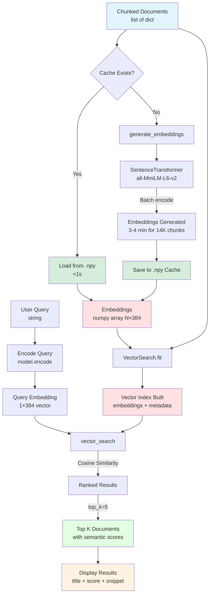

# Vector Search Integration - Embedding Generation Pipeline

**Phase:** 15 (Vector Search Integration)
**Purpose:** Demonstrate semantic search with sentence embeddings and cosine similarity

## Data Flow Diagram



## Key Components

### Input
- **Chunked Documents:** Output from Day 2 chunking strategies
- **Structure:** `list[dict]` with keys: `content`, `metadata`, `chunk_id`

### Model: SentenceTransformer (all-MiniLM-L6-v2)

**Why this model:**
- **384 dimensions:** Lightweight for CPU inference
- **22MB model size:** Fast download, small memory footprint
- **Trained on:** Sentence pairs for semantic similarity
- **Performance:** Best balance for course/prototype context

**Alternatives:**
| Model | Dimensions | Size | Use Case |
|-------|------------|------|----------|
| all-MiniLM-L6-v2 | 384 | 22MB | **Prototypes, courses** |
| all-mpnet-base-v2 | 768 | 420MB | Production (better quality) |
| multilingual-e5-large | 1024 | 2.2GB | Multilingual production |

### Embedding Generation: get_or_generate_embeddings()

**Cache Pattern (Production Optimization):**
```python
def get_or_generate_embeddings(texts, model, cache_path):
    if cache_path.exists():
        # <1s reload vs 3-4 min generation
        return np.load(cache_path)
    else:
        embeddings = model.encode(texts, show_progress_bar=True)
        np.save(cache_path, embeddings)
        return embeddings
```

**Performance:**
- **First Run:** 3-4 minutes for 14,254 paragraph chunks
- **Cached Run:** <1 second to reload from .npy file
- **Storage:** ~21MB for 14K × 384 float32 embeddings

**Batch Processing:**
```python
embeddings = model.encode(
    texts,
    batch_size=32,           # Optimize for CPU
    show_progress_bar=True,  # tqdm progress tracking
    convert_to_numpy=True    # Return numpy array
)
```

### Index: VectorSearch (minsearch)

**Configuration:**
```python
vector_index = VectorSearch(
    text_fields=["title", "content"],  # Metadata to return
    keyword_fields=["chunk_id"]         # Exact match fields
)
```

**Index Building:**
```python
vector_index.fit(embeddings, prepared_chunks)
```

Stores:
1. **Embeddings Matrix:** N×384 numpy array (dense vectors)
2. **Document Metadata:** chunk_id, title, content mappings
3. **No inverted index:** Direct vector comparison

### Search: vector_search()

**Algorithm: Cosine Similarity**
```python
def cosine_similarity(query_vec, doc_vec):
    return np.dot(query_vec, doc_vec) / (
        np.linalg.norm(query_vec) * np.linalg.norm(doc_vec)
    )
```

**Scoring:**
1. Encode query → 384-dim vector
2. Compute cosine similarity with all document embeddings
3. Sort by similarity score (descending)
4. Return top_k results

**Score Range:** [-1, 1]
- 1.0 = Perfect semantic match
- 0.0 = Orthogonal (unrelated)
- -1.0 = Opposite meaning (rare)

### Output
- **Ranked Results:** List of dicts with `title`, `content`, `score`, `chunk_id`
- **Sorted:** Descending by cosine similarity

## Example: Evidently Docs

**Query:** `"how to secure AI models against attacks"`

**Vector Search Results:**
1. **Content:** "...security best practices for ML systems..." - Score: 0.82
2. **Content:** "...protecting models from adversarial examples..." - Score: 0.79
3. **Content:** "...model robustness and safety guidelines..." - Score: 0.74

**Why It Works:**
- No exact keywords required ("secure" → "security", "attacks" → "adversarial")
- Semantic understanding of "AI models" ≈ "ML systems"
- Handles paraphrases naturally

## Trade-offs

| Aspect | Strength | Limitation |
|--------|----------|------------|
| **Semantic Understanding** | Handles paraphrases, synonyms | May miss exact acronyms (LLM01) |
| **Conceptual Queries** | "how to" questions work well | Slower than text search |
| **Multilinguality** | Some models support 100+ languages | English-only models faster |
| **Cold Start** | 3-4 min first run (14K chunks) | Cache solves this (<1s reload) |

## When to Use

✅ **Use Vector Search When:**
- Users ask conceptual questions ("how to", "what is")
- Queries contain paraphrases or synonyms
- Semantic understanding matters more than exact terms
- Multilingual support is needed

❌ **Avoid Vector Search When:**
- Exact acronyms/codes are critical (LLM01, CVE-2024-1234)
- Sub-second latency is required (use cached index)
- Corpus is <100 documents (text search sufficient)

## Production Considerations

### 1. Cache Strategy
```python
cache_dir = Path("data/embeddings")
cache_dir.mkdir(parents=True, exist_ok=True)
cache_path = cache_dir / f"{corpus_name}_embeddings.npy"
```

**Best Practices:**
- Save embeddings immediately after generation
- Use descriptive cache names (corpus + chunk strategy)
- Version embeddings (model changes invalidate cache)

### 2. Model Selection

**Course/Prototype:**
- `all-MiniLM-L6-v2` (384-dim, 22MB)
- Fast CPU inference, good quality

**Production:**
- `all-mpnet-base-v2` (768-dim, 420MB)
- Better semantic quality, still CPU-friendly
- ~2x slower than MiniLM

**Multilingual:**
- `multilingual-e5-large` (1024-dim, 2.2GB)
- Supports 100+ languages
- GPU recommended

### 3. Batch Size Tuning

```python
# CPU-optimized
batch_size = 32  # Course context

# GPU-optimized (production)
batch_size = 256  # 10x faster on GPU
```

### 4. Dimensionality Reduction (Advanced)

For very large corpora (>1M documents):
```python
from sklearn.decomposition import PCA

# Reduce 384 → 128 dimensions (3x storage savings)
pca = PCA(n_components=128)
reduced_embeddings = pca.fit_transform(embeddings)
```

**Trade-off:** 5-10% quality loss for 3x storage/speed gain

### 5. Approximate Nearest Neighbors (Scaling)

For >100K documents, use FAISS or Annoy:
```python
import faiss

# Build HNSW index for O(log N) search
index = faiss.IndexHNSWFlat(384, 32)
index.add(embeddings)

# Search 1M documents in <10ms
distances, indices = index.search(query_embedding, k=5)
```

## Performance Benchmarks

| Corpus Size | Generation Time | Cache Size | Search Time (top-5) |
|-------------|----------------|------------|---------------------|
| 1,000 chunks | ~15 seconds | 1.5MB | 5ms |
| 10,000 chunks | ~2.5 minutes | 15MB | 50ms |
| 100,000 chunks | ~25 minutes | 150MB | 500ms |
| 1M chunks | ~4 hours | 1.5GB | 5s (use FAISS!) |

**Hardware:** MacBook Pro M1, 16GB RAM, CPU-only

---

**Phase:** 15 - Vector Search Integration
**Created:** 2026-04-06
**Related Diagrams:**
- [Text Search Foundation](text-search-foundation.md) - Phase 14
- [Hybrid Search RRF Fusion](hybrid-search-rrf-fusion.md) - Phase 16
