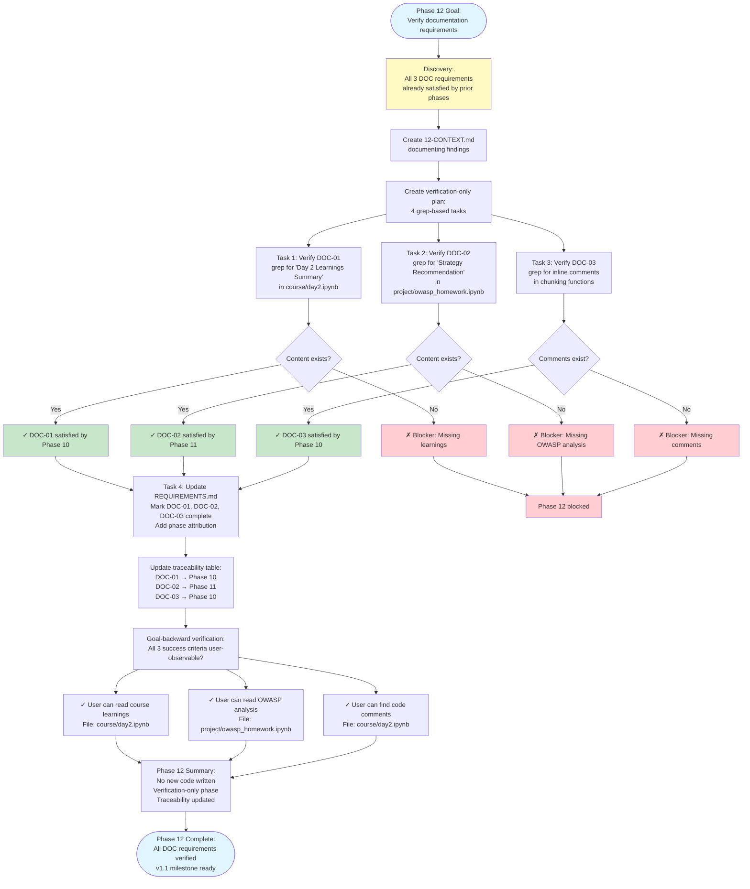

# Phase 12: Documentation & Synthesis Verification



## Phase 12 Key Finding

**All 3 requirements were already complete** before Phase 12 execution:

| Requirement | Completed By | Evidence Location |
|-------------|--------------|-------------------|
| DOC-01: Course learnings | Phase 10 | `course/day2.ipynb` → "## Day 2 Learnings Summary" |
| DOC-02: OWASP findings | Phase 11 | `project/owasp_homework.ipynb` → Three-section analysis |
| DOC-03: Code comments | Phase 10 | `course/day2.ipynb` → Inline comments in functions |

## Verification Tasks

### Task 1: DOC-01 Evidence
```bash
grep -q "## Day 2 Learnings Summary" course/day2.ipynb
# Exit code 0 = Found

# Content verified:
# - Comparison table (Strategy | Best For | Pros | Cons | Cost)
# - Key Gotchas section
# - Decision Framework section
```

### Task 2: DOC-02 Evidence
```bash
grep -q "Strategy Recommendation for OWASP" project/owasp_homework.ipynb
# Exit code 0 = Found

# Content verified:
# - Quantitative Comparison (references 3563, 14254, 1023, 14745 chunks)
# - Strategy Recommendation for OWASP (section chunking recommended)
# - Decision Framework (5-option generalized decision tree)
```

### Task 3: DOC-03 Evidence
```bash
grep -q "Slide by (size - overlap)" course/day2.ipynb
# Exit code 0 = Found

# Comments verified:
# - "Slide by (size - overlap) to create overlap between adjacent chunks"
# - "Filter empty paragraphs created by multiple blank lines"
# - "Section ends where next ## starts, or at doc end"
```

### Task 4: Traceability Update
```markdown
### Documentation

- [x] **DOC-01**: Document course material learnings in `course/day2.ipynb` *(completed in Phase 10)*
- [x] **DOC-02**: Document OWASP-specific findings in `project/owasp_homework.ipynb` *(completed in Phase 11)*
- [x] **DOC-03**: Include code comments explaining chunking strategy tradeoffs *(completed in Phase 10)*
```

## GSD Workflow Pattern: Verification-Only Phase

This phase demonstrates a valid GSD pattern:

**When requirements are satisfied proactively in earlier phases:**
1. Later phase finds its work already done
2. Create verification-only plan (grep checks, not new code)
3. Update traceability to reflect actual completion phases
4. Mark phase complete

**Why this is correct:**
- Requirements can be satisfied across multiple phases
- Later phases may find their scope already complete
- Verification confirms user-observable truths exist
- Traceability provides accurate historical record

## Commit Message Pattern

Since no new content was created, commit message acknowledges pre-existing work:

```
docs(12): acknowledge documentation requirements completed in prior phases

- DOC-01 satisfied by Phase 10 (course learnings summary)
- DOC-02 satisfied by Phase 11 (OWASP analysis)
- DOC-03 satisfied by Phase 10 (inline comments)

Phase 12 verifies completeness and updates traceability.
```

## Success Criteria Verification

All 3 success criteria are **user-observable truths:**

1. ✅ "User can read Day 2 course material learnings documented in `course/day2.ipynb`"
   - Grep check confirms section exists
   - Manual inspection shows comprehensive table and gotchas

2. ✅ "User can read OWASP-specific findings documented in `project/owasp_homework.ipynb`"
   - Grep check confirms three-section analysis exists
   - Quantitative comparison references actual metrics

3. ✅ "User can find code comments explaining chunking strategy tradeoffs throughout implementation"
   - Grep checks confirm inline comments in key functions
   - Comments explain non-obvious decisions (overlap rationale, boundary detection)

## Phase 12 Statistics

- **Tasks:** 4 (all verification, no new code)
- **Files modified:** 1 (.planning/REQUIREMENTS.md)
- **Lines changed:** ~10 (traceability updates)
- **Duration:** <1 minute
- **Commits:** 1 (acknowledgment commit)
